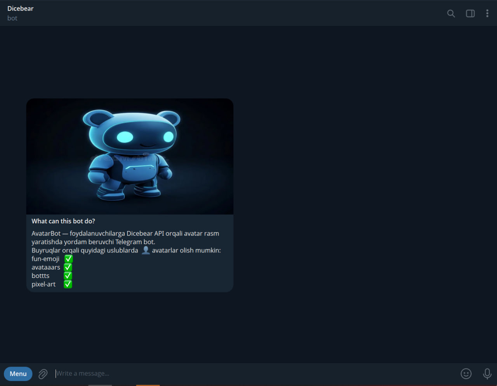
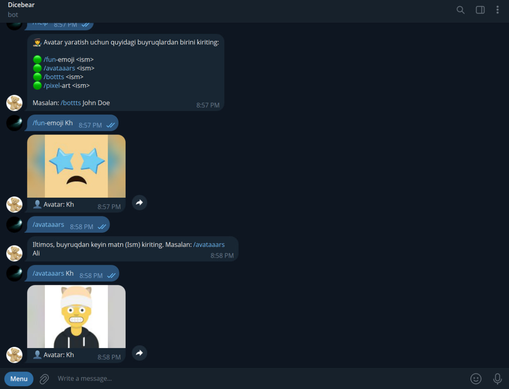

# 🤖 Dicebear Avatar Bot

**Dicebear Avatar Bot** — bu foydalanuvchidan matnli buyruq qabul qilib, Dicebear API orqali avtomatik ravishda avatar PNG rasm yaratib, uni foydalanuvchiga yuboruvchi Telegram botdir.

---

## 🧩 Asosiy imkoniyatlar

- Dicebear'ning quyidagi uslublarini qo‘llab-quvvatlaydi:
  - `/fun-emoji`
  - `/avataaars`
  - `/bottts`
  - `/pixel-art`
- Har bir buyruqdan keyin yozilgan matn (seed) asosida bir xil avatar yaratiladi
- Foydalanuvchi buyruqni noto‘g‘ri yuborsa yoki matn kiritilmasa, mos javob qaytariladi
- Rasmni olish va yuborishda xatoliklar bo‘lsa, foydalanuvchiga ogohlantirish yuboriladi
- `/help` buyrug‘i orqali botdan qanday foydalanish haqida ko‘rsatma olinadi

---

## 📷 Ilk ko‘rinish

---

## ⚙️ Ishlash jarayoni

1. Foydalanuvchi quyidagi kabi buyruq yuboradi:
2. 
